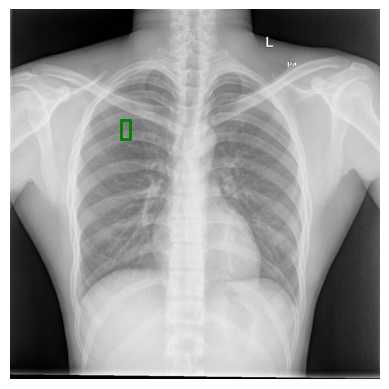
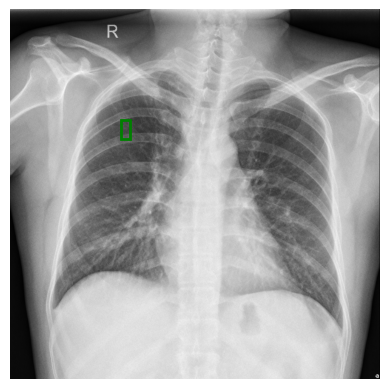

# Preprocing

This folder is for preparing images for modeling and training neural network. All the steps I have done in this pre-processing are as follows:

## Original image
I found this dataset from the Keggel website and did not upload it due to the large volume of the dataset.
You can find the dataset in this link: https://www.kaggle.com/datasets/nikhilpandey360/chest-xray-masks-and-labels

## Thresholding (based on lung color)
This part was one of the most challenging parts of this image preparation.
For some reason, the lungs were not exactly the same color, so in one picture the lung is black and in the other picture the lung is white.(It has nothing to do with lung health.)

As you can see in the two pictures below, the lungs have different colors in different pictures. As a result, the step of separating the lung from the original image should be done based on the original color of the lung.
So I performed the separation step based on the average pixels of a rectangle that were inside the lungs.(as you can see in the pictures below the dimensions and coordinates of this rectangle are located inside the lung in all images)
| Lighter lungs                                   | darker lung                             |
| -----------------------------------             | ---------------------------------      |
|      |  |

### Thresholding
After determining the color of the lung, I apply the thresholding filter to the image. This filter divides the value of each pixel into white and black groups based on the threshold we specify. This threshold is determined based on the color of the lungs that I specified in the previous step

### Blacken from left side
At this stage, I should have extracted the lung from the image, but the problem was that the background image and the lungs were the same color.
Since I did not find a ready-made function, I started working on it myself. I wrote a function that scans the image pixel by pixel once from the left side and once from the right side. If it sees a white pixel, it turns it black and repeats this process until it reaches the lung area.

| Blacken from left side                                  | Blacken from right side                            |  Blacken from both side|
| -----------------------------------             | ---------------------------------      |---------------------------|
|      |  |             |

### Top contours
Now it was time to extract the lung from the image. I used the contour and at the end I added the big contours related to the lungs in a completely black image.

### Blur filter
For easier and more accurate processing and not to confuse the machine during the training phase, I had to correct the side of the lungs, which is very ugly and irregular. As a result, I blurred the image for the lungs. As you can see in the picture below, the armpits of the lungs are no longer irregular.

### Threshold again
In the last step, I just had to apply the threshold once more to get the final image.

